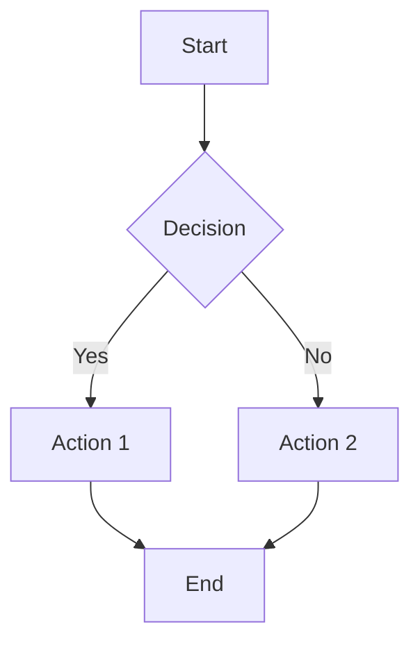
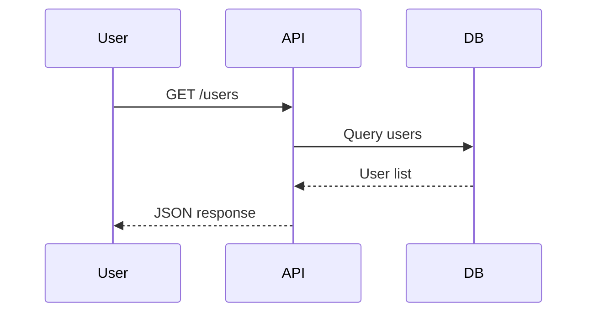

# Test Rendering Page

This page tests every supported markdown rendering feature.

## Headings

### Third Level Heading

#### Fourth Level Heading

##### Fifth Level Heading

###### Sixth Level Heading

## Text Formatting

This is **bold text** and this is *italic text*. You can also do ***bold italic***.

This is `inline code` within a paragraph.

Here is a [link to example.com](https://example.com) and an auto-linked URL.

## Blockquotes

> This is a blockquote.
> It can span multiple lines.

> **Blockquote with formatting:**
> - List inside blockquote
> - With `inline code`
> - And a [link](https://example.com)

## Lists

### Unordered List

- Item one
- Item two
  - Nested item A
  - Nested item B
    - Deeply nested item
- Item three

### Ordered List

1. First item
2. Second item
   1. Sub-item one
   2. Sub-item two
3. Third item

## Tables

| Feature | Status | Notes |
|---------|--------|-------|
| Tables | ✅ | Borders and alternating rows |
| Code Blocks | ✅ | Shiki syntax highlighting |
| Mermaid | ✅ | Diagram rendering |
| Admonitions | ✅ | MkDocs `!!!` syntax |
| Heading Anchors | ✅ | Hover permalink |

| Left | Center | Right |
|:-----|:------:|------:|
| L1   |   C1   |    R1 |
| L2   |   C2   |    R2 |

## Code Blocks

### JavaScript

```javascript
function fibonacci(n) {
  if (n <= 1) return n;
  return fibonacci(n - 1) + fibonacci(n - 2);
}

console.log(fibonacci(10)); // 55
```

### Python

```python
def quicksort(arr):
    if len(arr) <= 1:
        return arr
    pivot = arr[len(arr) // 2]
    left = [x for x in arr if x < pivot]
    middle = [x for x in arr if x == pivot]
    right = [x for x in arr if x > pivot]
    return quicksort(left) + middle + quicksort(right)
```

### TypeScript

```typescript
interface User {
  id: number;
  name: string;
  email: string;
}

async function fetchUser(id: number): Promise<User> {
  const response = await fetch(`/api/users/${id}`);
  return response.json();
}
```

### Bash

```bash
#!/bin/bash
for file in *.md; do
  echo "Processing: $file"
  wc -w "$file"
done
```

### HTML

```html
<div class="container">
  <h1>Hello World</h1>
  <p>This is a paragraph.</p>
</div>
```

### CSS

```css
.container {
  display: flex;
  justify-content: center;
  align-items: center;
  min-height: 100vh;
}
```

## Mermaid Diagrams

### Flowchart



### Sequence Diagram



## Admonitions

!!! note "This is a Note"
    Notes are used for general information and tips that readers should be aware of.

!!! warning "Caution"
    Be careful with this operation — it cannot be undone.

!!! tip "Helpful Tip"
    You can use keyboard shortcuts to navigate faster.

!!! danger "Danger Zone"
    This action will permanently delete all data.

!!! info
    This is an informational admonition without a custom title.

## Images


## Horizontal Rule

---

*End of rendering test.*
